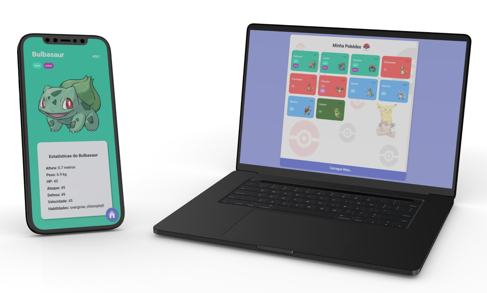

<h1 align="center">
  

  Pokédex Vanilla
</h1>

  <a href="#bookmark-sobre">Sobre</a>&nbsp;&nbsp;&nbsp;|&nbsp;&nbsp;&nbsp;
  <a href="#rocket-tecnologias">Tecnologias</a>&nbsp;&nbsp;&nbsp;|&nbsp;&nbsp;&nbsp;
  <a href="#paintbrush-layout">Layout</a>&nbsp;&nbsp;&nbsp;|&nbsp;&nbsp;&nbsp;
  <a href="https://pokedex-vanilla-andre-horman.vercel.app/" target="_blank">Aplicação na Vercel</a>

  

## :bookmark: Sobre

A **Pokédex Vanilla** é uma aplicação Web desenvolvida com HTML5, CSS3 e JavaScript. Ela permite que os usuários visualizem informações sobre os 151 primeiros Pokémon, como nome, tipo, altura, peso e habilidades.
  
Essa aplicação foi desenvolvida durante o Santander Bootcamp 2023, realizada pela [DIO](https://www.dio.me/).Para o desenvolvimento da aplicação, utilizei a [Poké API](https://pokeapi.co/), uma API RESTful que fornece dados sobre os Pokémon.

Para executar a aplicação, realize os passos a seguir:

* Clone o repositório ou realize um fork para o seu GitHub.
* Entre no diretório do projeto --> `cd pokedex-vanilla`.
* Instale as dependências do projeto --> `npm install`.
* Execute a aplicação --> `npm run dev`.

 

  

## :rocket: Tecnologias

  - `HTML`
  > Linguagem de marcação utilizada para estruturar o conteúdo da aplicação web.
  - `CSS`
  > Utilizado para estilização e apresentação visual da aplicação.
  - `JavaScript`
  > Linguagem de programação utilizada para implementar a lógica da aplicação.
  - `Poké API`
  > API utilizada para obter os dados dos Pokémon.
  - `Vercel`
  > Plataforma de hospedagem voltada para aplicações web modernas e escaláveis.

## :paintbrush: Layout

Inspirei-me no [Layout](https://dribbble.com/shots/6540871-Pokedex-App/attachments/6540871-Pokedex-App?mode=media) criado por **Saepul Nahwan** para orientar o meu projeto.

---
